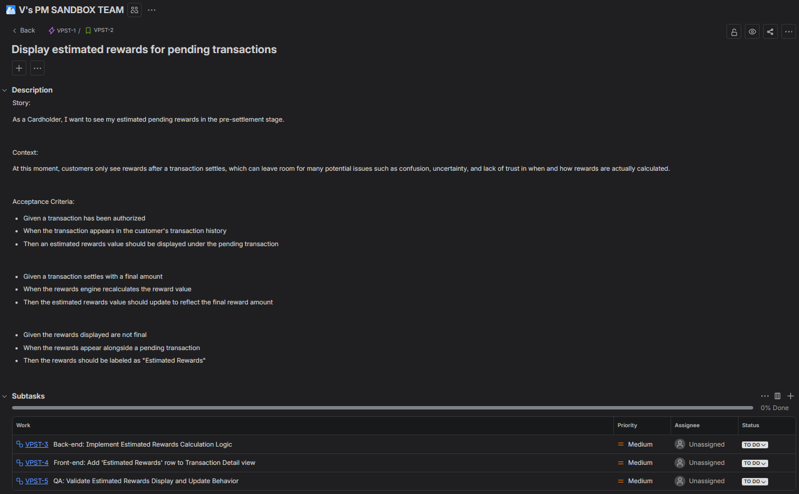
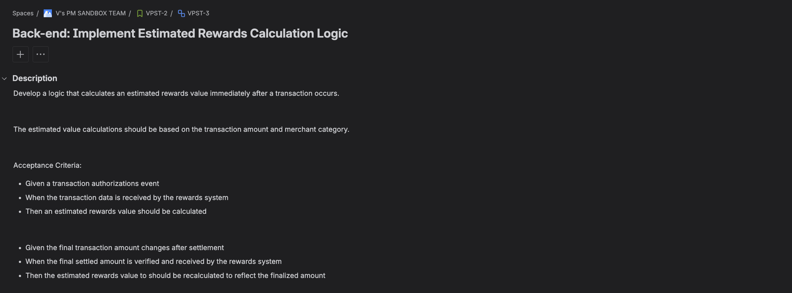
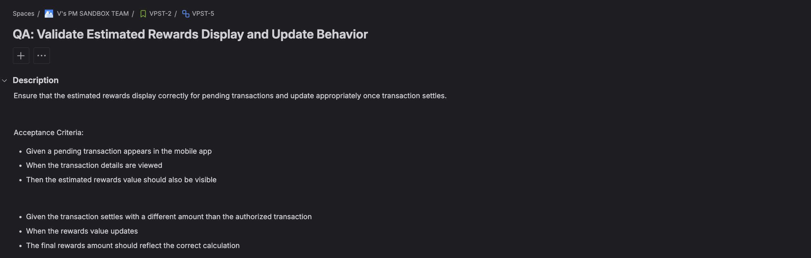
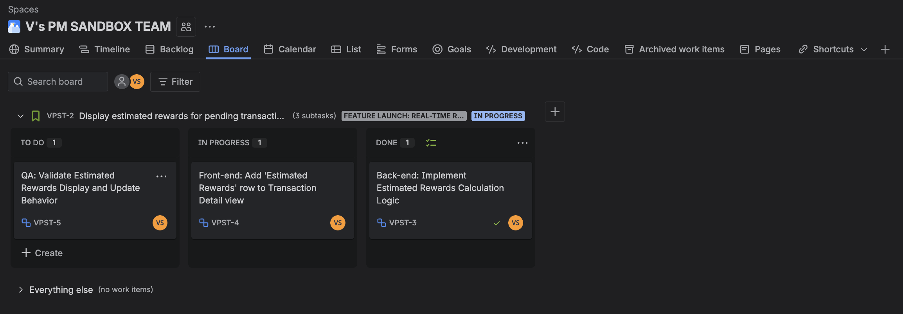

# Jira Ticket Implementation

## Overview

This section will how the proposed feature would be implemented within a product development workflow, the requirements were translated into real Jira tickets in a demo environement.

The tickets follow a common agile structure used by many product and engineering teams:

Epic → Story → Subtasks

This structure allows the product requirement to be broken down into smaller implementation tasks across backend development, frontend development, and quality assurance.

## Jira Ticket Structure

The feature was organized in Jira using the following hierarchy:

Epic  
Feature Launch: Real-Time Rewards Transparency

Story  
Display Estimated Rewards for Pending Transactions

Subtasks  
  • Back-end: Implement Estimated Rewards Calculation Logic
  • Front-end: Add 'Estimated Rewards' row to Transaction Detail view 
  • QA: Validate Estimated Rewards Display and Update Behavior

## Story Description

**Title:** Display Estimated Rewards for Pending Transactions

**Issue Type:** User Story

### Description

Customers currently do not see reward points until transactions fully settle. This delay can create confusion and reduce engagement with rewards programs.

This story introduces an estimated rewards value displayed during the pending transaction phase, giving customers earlier insight into the rewards generated from their purchases while maintaining the ability to update rewards once the transaction settles.

## Acceptance Criteria

Given a transaction has been authorized  
When the transaction appears in the customer's transaction history  
Then an estimated rewards value should be displayed under the pending transaction

Given a transaction settles with a final amount  
When the rewards engine recalculates the reward value  
Then the estimated rewards value should update to reflect the final reward amount

Given the rewards displayed are not final  
When the rewards appear alongside a pending transaction  
Then the rewards should be labeled as "Estimated Rewards"

## Subtask Breakdown

To implement the feature, the work was broken down into several subtasks representing backend development, frontend requirements, and QA validation.

### Backend Subtask
**Implement Estimated Rewards Calculation Logic**

Responsible for calculating an estimated rewards value immediately after a transaction authorization event. The calculation uses transaction amount and merchant category code to **estimate** the expected rewards value.

-----------

### Frontend Subtask
**Update Transaction UI to Display Estimated Rewards**

Modify the transaction history interface in the mobile and web applications to display estimated rewards alongside pending transactions. The interface should clearly indicate that the rewards value is an estimate, readjust to final when transaction fully settles.

-----------

### QA Subtask
**Validate Estimated Rewards Display and Update Behavior**

Verify that estimated rewards appear correctly for pending transactions and update appropriately once the transaction settles and the final reward value is calculated.

## Jira Implementation

The following screenshots illustrate how the feature was organized and tracked within Jira.

### Story with Subtasks

### Backend Subtask Example

### Frontend Subtask Example

### QA Subtask Example

### Jira Board View

